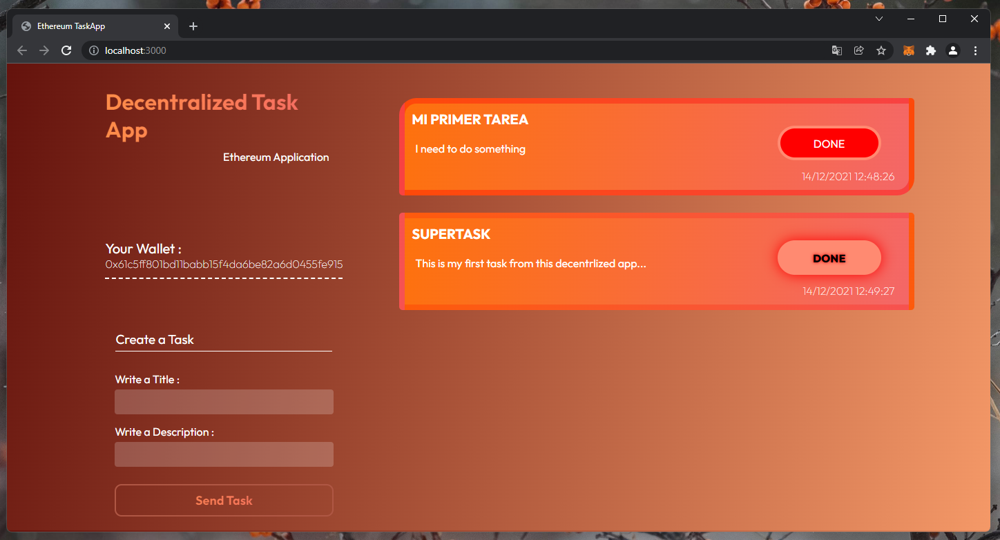

# Ethereum Task App with Solidity and Javascript



This task app is a decentralized app. For run this repo you need to do the next steps.
I recommend to use a Ganache for the transactions.

### Download this repo:
``` bash
git clone https://www.github.com/Javi-bit/ethereum-task-app
```

### Download the dependecies:
``` bash
npm i
```

### Run in ./ethereum-task-app:
``` bash
truffle migrate --reset
```
or
``` bash
truffle deploy
```

### Then, run:
``` bash
npm run dev
```